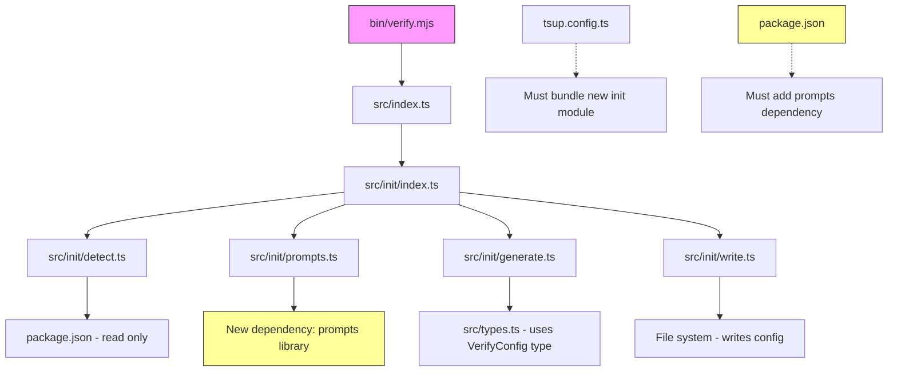

# Plan: Add `--init` Flag to verify.mjs

## Background Information

The `@halecraft/verify` package is a hierarchical verification runner that executes tasks (linting, type-checking, testing, etc.) in parallel with terse output. Users configure it via a `verify.config.ts` file that defines the task tree.

Currently, users must manually create this configuration file. The help text in [`bin/verify.mjs`](bin/verify.mjs:78) shows an example, but there's no automated way to scaffold a new config.

## Problem Statement

New users must manually create a `verify.config.ts` file from scratch, which:
- Requires understanding the config schema
- Is error-prone (typos, incorrect structure)
- Doesn't leverage existing project context (package.json scripts)

## Success Criteria

1. Running `verify --init` produces an interactive CLI experience that:
   - Auto-detects potential verification tasks from `package.json` scripts
   - Presents checkboxes for users to select which tasks to include
   - Falls back to a minimal skeleton if nothing is detected
2. Running `verify --init --yes` (or `-y`) skips prompts and auto-accepts all detected tasks
3. Non-TTY environments automatically behave like `--yes` (no hanging on prompts)
4. Generated file is `verify.config.ts` by default
5. Supports `--config <path>` to specify alternate output path/format (`.ts`, `.mts`, `.js`, `.mjs`)
6. Warns and exits if config file already exists, unless `--force` is provided
7. Generated config is valid TypeScript that imports `defineConfig` from `@halecraft/verify`

## The Gap

| Current State | Desired State |
|---------------|---------------|
| No `--init` flag | `--init` flag with interactive task selection |
| Manual config creation | Auto-detection from package.json |
| No overwrite protection | `--force` flag for overwrite |
| Single output format | Configurable output format via `--config` |

## Milestones and Tasks

### Milestone 1: CLI Argument Parsing for `--init` ✅

- ✅ Add `--init` flag to [`parseArgs()`](bin/verify.mjs:8) function
- ✅ Add `--force` flag to [`parseArgs()`](bin/verify.mjs:8) function
- ✅ Add `--yes` / `-y` flag to skip interactive prompts and auto-accept all detected tasks
- ✅ Update [`printHelp()`](bin/verify.mjs:63) to document new flags
- ✅ Add early exit in [`main()`](bin/verify.mjs:113) to handle `--init` flow before normal verification

### Milestone 2: Task Auto-Detection Module ✅

- ✅ Create new file [`src/init/detect.ts`](src/init/detect.ts) for detection logic
- ✅ Implement `detectFromPackageJson()` function that:
  - Reads `package.json` from cwd
  - Identifies common verification scripts (lint, test, typecheck, format, build, etc.)
  - Returns array of detected task candidates with suggested keys and commands
- ✅ Define heuristics for common script patterns:
  - `lint`, `eslint`, `biome check` → format/lint task
  - `test`, `vitest`, `jest` → logic/test task
  - `typecheck`, `tsc` → types task
  - `build` → build task
- ✅ Export detection utilities from [`src/init/index.ts`](src/init/index.ts)

### Milestone 3: Interactive CLI Prompts ✅

- ✅ Add `@inquirer/prompts` dependency for interactive UI
- ✅ Create [`src/init/prompts.ts`](src/init/prompts.ts) for interactive UI
- ✅ Implement checkbox prompt showing detected tasks with:
  - Task name/key
  - Detected command
  - Pre-selected by default
- ✅ Handle case where no tasks detected (show info message, proceed with skeleton)
- ✅ Support `--yes` / `-y` flag to skip prompts and auto-accept all detected tasks
- ✅ Gracefully handle non-TTY environments (auto-accept like `--yes`)
- 🔴 Allow user to add custom tasks interactively (optional enhancement)

### Milestone 4: Config File Generation ✅

- ✅ Create [`src/init/generate.ts`](src/init/generate.ts) for config generation
- ✅ Implement `generateConfigContent()` that:
  - Takes selected tasks array
  - Produces valid TypeScript/JavaScript config string
  - Uses proper indentation and formatting
- ✅ Support multiple output formats based on file extension:
  - `.ts` / `.mts` → TypeScript with `import` syntax
  - `.js` / `.mjs` → JavaScript with `import` syntax
- ✅ Implement skeleton template for when no tasks are selected/detected

### Milestone 5: File Writing with Safety Checks ✅

- ✅ Create [`src/init/write.ts`](src/init/write.ts) for file operations
- ✅ Implement existence check for target config file
- ✅ Show warning and exit if file exists (without `--force`)
- ✅ Implement `--force` override behavior
- ✅ Write generated content to file with proper encoding

### Milestone 6: Integration and Main Flow ✅

- ✅ Create [`src/init/index.ts`](src/init/index.ts) as main entry point for init feature
- ✅ Implement `runInit()` function that orchestrates:
  1. Determine output path (default or from `--config`)
  2. Check for existing file (respect `--force`)
  3. Run detection
  4. Show interactive prompts
  5. Generate config
  6. Write file
  7. Print success message
- ✅ Export `runInit` from [`src/index.ts`](src/index.ts)
- ✅ Wire up in [`bin/verify.mjs`](bin/verify.mjs:113) main function

### Milestone 7: Testing and Documentation ✅

- ✅ Add unit tests for detection logic ([`src/init/detect.test.ts`](src/init/detect.test.ts) - 15 tests)
- ✅ Add unit tests for config generation ([`src/init/generate.test.ts`](src/init/generate.test.ts) - 11 tests)
- ✅ Update README with `--init` documentation ([`README.md`](README.md))
- ✅ Add examples of generated configs (in README.md)

## Transitive Effect Analysis

### Dependency Chain Analysis

1. **Direct Dependencies**:
   - [`bin/verify.mjs`](bin/verify.mjs) → New `--init` and `--force` flags
   - [`src/index.ts`](src/index.ts) → New export for `runInit`
   - [`package.json`](package.json) → New dependency for interactive prompts

2. **Transitive Dependencies**:
   - Adding a prompts library adds its transitive deps to the bundle
   - The init module will import from [`src/types.ts`](src/types.ts) for type definitions
   - Build output (`dist/`) will grow with new init module

3. **Potential Breaking Changes**:
   - None expected - this is purely additive functionality
   - The `--config` flag already exists for specifying config path; reusing it for init output is consistent

4. **Build Considerations**:
   - `tsup` should automatically pick up new `src/init/*.ts` files
   - May want to consider code-splitting if init module is large (optional optimization)

5. **Runtime Considerations**:
   - Interactive prompts require TTY; should gracefully handle non-TTY environments
   - Detection reads `package.json` synchronously - acceptable for init command
