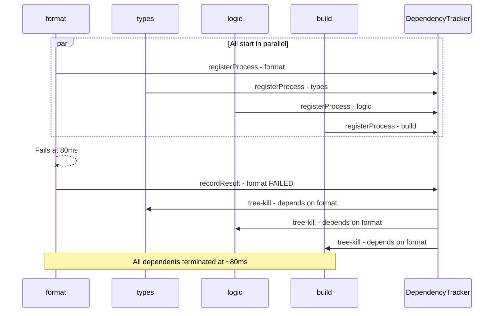

# Plan: Implement `reportingDependsOn` for Smart Output Suppression

## Background

The `@halecraft/verify` tool runs verification tasks in parallel for maximum speed. However, when a syntax error occurs, multiple tools report the same underlying issue:

- Biome: "expected `,` but found `dim`"
- tsc: "error TS1005: ',' expected"
- tsgo: "error TS1005: ',' expected"
- esbuild: "Expected `}` but found `dim`"

This creates noisy output where the developer sees 4+ error reports for what is fundamentally 1 problem.

## Problem Statement

**Current behavior:** All tasks run in parallel and report independently, leading to redundant error messages when a root cause (like a syntax error) cascades through multiple tools.

**Desired behavior:** Maintain full parallel execution for speed, but intelligently suppress redundant failure reports when a dependency task has already failed.

## Success Criteria

1. All tasks still execute in parallel (no speed regression)
2. New `reportingDependsOn` config option available on tasks
3. Tasks with failed dependencies show "suppressed" instead of their own failure
4. Only the root cause failure shows detailed logs
5. Exit code still reflects overall pass/fail status
6. Works with both TTY and non-TTY reporters

## The Gap

Currently, the runner:

1. Executes all tasks in parallel
2. Reports each task's result immediately upon completion
3. Shows logs for all failed tasks

We need to:

1. Buffer task results until dependencies complete
2. Determine if a failure should be reported or suppressed
3. Add a new "suppressed" status for cascaded failures
4. Update reporters to handle the new status

## Milestones and Tasks

### Milestone 1: Update Types and Config ✅

- ✅ Add `reportingDependsOn?: string[]` to [`VerificationNode`](src/types.ts:50) interface in `types.ts`
- ✅ Add `suppressed?: boolean` and `suppressedBy?: string` to [`TaskResult`](src/types.ts:116) interface
  - Note: Using "suppressed" not "skipped" - the task actually ran, we're just hiding its output
- ✅ Keep `ok` field semantics unchanged - `ok: false` still means the task failed

### Milestone 2: Implement Dependency Resolution in Runner ✅

- ✅ Create `ReportingDependencyTracker` class in [`runner.ts`](src/runner.ts:42)
- ✅ Implement explicit cycle detection at config load time using DFS with coloring
  - Fail fast with clear error message showing the cycle path
  - Do NOT rely on async waiting (causes deadlock, not validation)
- ✅ Support both key-based and path-based matching with clear precedence:
  1. Exact path match first (e.g., `"types:tsc"`)
  2. Key match second (e.g., `"format"` matches task with key `"format"`)
  3. Error if ambiguous (multiple matches for same identifier)
- ✅ Track which tasks have completed and their pass/fail status
- ✅ Determine if a task's failure should be suppressed based on dependency failures

### Milestone 3: Update Result Reporting Logic ✅

- ✅ Buffer task results until all `reportingDependsOn` dependencies complete
- ✅ Mark tasks as "suppressed" if any dependency failed
- ✅ Emit results in dependency order (dependencies before dependents)
- ✅ Suppress logs for suppressed tasks
- ✅ Propagate suppressed status from children to parent groups:
  - If all children are suppressed, parent is suppressed
  - If some children are suppressed and others passed, parent shows mixed status

### Milestone 4: Update Reporters ✅

- ✅ Add "suppressed" status rendering to [`BaseReporter`](src/reporter.ts:66) - `suppressedMark()` method
- ✅ Update [`LiveDashboardReporter`](src/reporter.ts:226) to show suppressed tasks with ⊘ symbol
- ✅ Update [`SequentialReporter`](src/reporter.ts:394) to show suppressed tasks
- ✅ Update [`JSONReporter`](src/reporter.ts:446) to include suppressed status in output
  - Add `suppressed: boolean` and `suppressedBy: string` fields
  - Keep all existing fields for backward compatibility
- ✅ Only show logs for non-suppressed failed tasks

### Milestone 5: Update Init Detection ✅

- ✅ Auto-add `reportingDependsOn: ["format"]` for types/logic/build tasks in [`detect.ts`](src/init/detect.ts:319)
- ✅ Update [`generate.ts`](src/init/generate.ts:28) to include `reportingDependsOn` in generated config
- ✅ Add example to README

### Milestone 6: Testing and Documentation ✅

- ✅ Add unit tests for dependency resolution (cycle detection, key/path matching) in [`runner.test.ts`](src/runner.test.ts)
- ✅ Update README with `reportingDependsOn` documentation

## Transitive Effect Analysis

### Direct Dependencies

1. **[`types.ts`](src/types.ts)** → Changes to `VerificationNode` and `TaskResult` interfaces

   - Affects: `runner.ts`, `reporter.ts`, `config.ts`

2. **[`runner.ts`](src/runner.ts)** → New dependency tracking and result buffering

   - Affects: `index.ts` (verify function), reporters

3. **[`reporter.ts`](src/reporter.ts)** → New "suppressed" status handling
   - Affects: All reporter classes

### Transitive Dependencies

1. **`VerificationNode` change** →

   - `config.ts` (defineTask, defineConfig) →
   - `init/detect.ts` (DetectedTask) →
   - `init/generate.ts` (config generation) →
   - Generated user configs

2. **`TaskResult` change** →

   - `runner.ts` (result creation) →
   - `reporter.ts` (result display) →
   - `JSONReporter` (serialization) →
   - External tools consuming JSON output

3. **Runner callback timing change** →
   - `LiveDashboardReporter` (expects immediate callbacks) →
   - Spinner animation (may need adjustment for buffered results)

### Risk Mitigation

1. **Backward compatibility**: `reportingDependsOn` is optional, existing configs work unchanged
2. **JSON output**: Add `suppressed` and `suppressedBy` fields but keep existing fields for compatibility
3. **Performance**: Buffering adds minimal overhead since results are small objects
4. **Circular dependencies**: Validate at config load time with DFS cycle detection, fail fast with clear error showing cycle path

## Example Output

### Before (noisy)

```
✗ format (syntax error at line 14)
✗ types:tsc (syntax error at line 14)
✗ types:tsgo (syntax error at line 14)
✗ build (syntax error at line 14)

==== FORMAT FAIL ====
[50 lines of biome output]

==== TYPES:TSC FAIL ====
[20 lines of tsc output]

==== TYPES:TSGO FAIL ====
[20 lines of tsgo output]

==== BUILD FAIL ====
[30 lines of esbuild output]
```

### After (clean)

```
✗ format (syntax error at line 14)
⊘ types (suppressed - format failed)
⊘ logic (suppressed - format failed)
⊘ build (suppressed - format failed)

==== FORMAT FAIL ====
[50 lines of biome output]

== verification: Failed ==
```

## Technical Learnings: Implementing `reportingDependsOn` for Smart Output Suppression

### Key Facts

1. **The Problem**: When running verification tasks in parallel (format, types, build, test), a single syntax error causes 4+ redundant error reports from different tools (Biome, tsc, tsgo, esbuild) - all reporting the same root cause.

2. **The Solution Design**: `reportingDependsOn` - a configuration option that declares reporting dependencies between tasks. When a dependency fails, dependent tasks are marked as "suppressed" to reduce noise.

### Critical Insights

#### 1. "Output Suppression" vs "Early Termination" - Two Different Problems

**Initial assumption**: Marking tasks as "suppressed" after they complete would solve the noise problem.

**Reality**: This only works for fast tasks. In practice:

- `format` fails at ~80ms
- `logic` (vitest) continues running for ~1100ms
- `types` (tsc) continues running for ~300ms
- `build` (tsup) continues running for ~900ms

**The real solution requires two mechanisms**:

1. **Output suppression**: Mark completed tasks as "suppressed" (this plan's scope)
2. **Process termination**: Kill running child processes when dependencies fail (future enhancement, out of scope)

#### 2. Dependency Resolution Requires Key-Based Matching

**Initial assumption**: Dependencies would be specified as full paths (e.g., `"types:tsc"`).

**Reality**: Users naturally specify dependencies as keys (e.g., `"format"`), not paths. The dependency tracker must:

- Match by exact path (`"types:tsc"`)
- Match by key (`"format"` matches task with path `"format"`)
- Notify waiters by both path AND key when results are recorded

```typescript
// Must handle both:
reportingDependsOn: ["format"]; // key-based
reportingDependsOn: ["types:tsc"]; // path-based
```

#### 3. Group Nodes Need Special Handling

**Scenario**: A group node `types` has children `types:tsc` and `types:tsgo`, both with `reportingDependsOn: ["format"]`.

**Problem**: If all children are suppressed, the parent group shows as "verified" because:

- `allOk = childResults.every(r => r.ok || r.suppressed)` → `true`
- No explicit suppressed check for the group itself

**Solution**: Add logic to propagate suppressed status from children to parent:

```typescript
const allSuppressed =
  childResults.length > 0 && childResults.every((r) => r.suppressed);
if (allSuppressed) {
  result.suppressed = true;
  result.suppressedBy = childResults[0].suppressedBy;
}
```

#### 4. Test Commands Must Avoid Shell Parsing Issues

**Problem**: String commands like `"exit 1"` or `"node -e \"process.exit(1)\""` get incorrectly parsed when split on whitespace.

**Solution**: Use the `VerificationCommand` object format in tests:

```typescript
// ❌ Fails due to shell parsing
{ key: "fail", run: "node -e \"process.exit(1)\"" }

// ✓ Works correctly
{ key: "fail", run: { cmd: "node", args: ["-e", "process.exit(1)"] } }
```

### Architecture Decisions

#### Async Coordination Pattern

The implementation uses a waiter pattern for async coordination:

```typescript
class ReportingDependencyTracker {
  private waiters: Map<string, Array<() => void>> = new Map();

  async waitForDependencies(path: string): Promise<void> {
    // If result exists, resolve immediately
    // Otherwise, register a waiter callback
  }

  recordResult(result: TaskResult): void {
    // Store result
    // Notify all waiters for this path/key
  }
}
```

This allows tasks to:

1. Execute in parallel for speed
2. Wait for specific dependencies before emitting results
3. Check dependency status to determine suppression behavior

### Milestone 7: Early Termination ✅

**PRIME DIRECTIVE**: Fastest possible feedback to user. Output suppression alone is insufficient - dependent tasks continue running for 400-1100ms after the root cause is detected.

#### Problem Statement

With output suppression only:
```
✗ format (87ms)           <- Root cause detected
✓ logic (489ms)           <- Wasted 400ms running tests
⊘ types:tsc (336ms)       <- Wasted 250ms
⊘ types:tsgo (200ms)      <- Wasted 113ms
```

With early termination:
```
✗ format (88ms)           <- Root cause detected
⊘ types:tsgo (176ms)      <- Killed ~88ms after start
⊘ logic (239ms)           <- Killed ~151ms after start
⊘ types:tsc (317ms)       <- Killed ~229ms after start
```

#### Implementation Tasks

- ✅ Add `tree-kill` dependency for cross-platform process tree termination
- ✅ Track `ChildProcess` references by task path in `ReportingDependencyTracker`
- ✅ Build reverse dependency map (task → list of dependents)
- ✅ On dependency failure, kill all dependent processes using `tree-kill`
- ✅ Return suppressed results for killed processes with partial output
- ✅ Handle race conditions (process exits naturally vs killed)

#### Technical Design

```typescript
// In ReportingDependencyTracker
class ReportingDependencyTracker {
  // Existing fields...
  
  /** Map of task path to its running ChildProcess */
  private processes: Map<string, ChildProcess> = new Map()
  
  /** Reverse map: task path → tasks that depend on it */
  private reverseDeps: Map<string, string[]> = new Map()
  
  /** Register a running process */
  registerProcess(path: string, proc: ChildProcess): void
  
  /** Called when a task fails - kills all dependent processes */
  killDependents(failedPath: string): void
}
```



#### Dependencies

- [`tree-kill`](https://www.npmjs.com/package/tree-kill) - Cross-platform process tree termination (~5KB, 1.5M weekly downloads)

#### Risk Mitigation

1. **Race conditions**: Process may exit naturally before kill signal arrives - handle gracefully
2. **Partial output**: Capture stdout/stderr up to termination point
3. **Exit codes**: Killed processes return 143 (128 + SIGTERM=15) - detect and mark as suppressed
4. **Windows compatibility**: `tree-kill` handles Windows process trees

### Mistakes to Avoid

1. **Don't assume string command parsing is simple** - Shell escaping is complex; use structured command objects for reliability

2. **Don't conflate "output suppression" with "early termination"** - They're separate concerns requiring different implementations

3. **Don't forget key-based dependency matching** - Users will specify `["format"]` not `["format:biome"]`

4. **Don't forget to propagate suppressed status to parent groups** - Otherwise groups show as "passed" when all children are suppressed

5. **Don't rely on async waiting for cycle detection** - It causes deadlock, not validation. Use explicit DFS with coloring at config load time.
