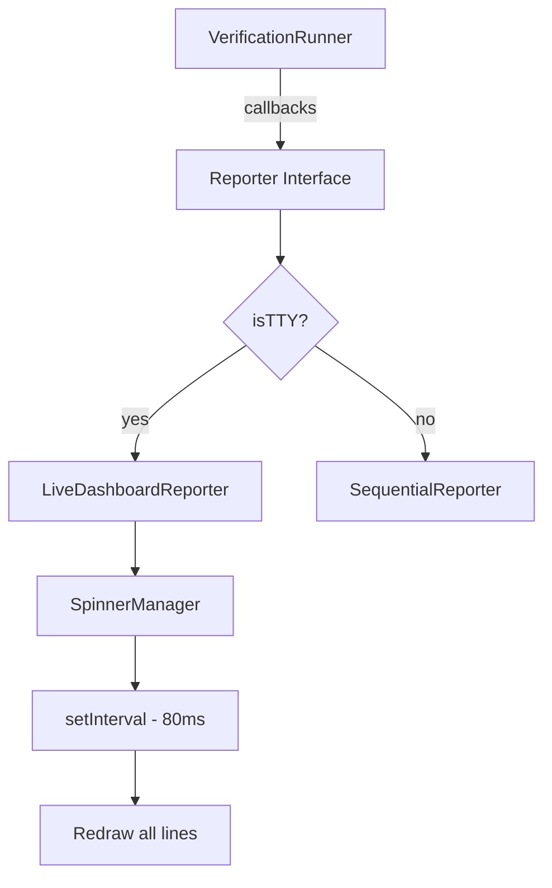

# Plan: TTY Live Dashboard Output

## Overview

Refactor the TTY reporter to show a live-updating dashboard where each verification task has a single line that updates in place with an animated spinner, replacing the current interleaved "starting/finished" log style.

## Current vs. New Output

### Before (Current)

```
→ starting format
→ starting logic
→ starting types
→ starting build
✓ finished format (681ms)
✓ finished types (695ms)
✓ finished logic (932ms)
✓ finished build (1352ms)

format: passed
logic: passed
types: passed
build: passed
```

### After (TTY - Live Dashboard, Default View)

Shows top-level tasks only (leaves and groups at root level):

```
✓ verified format (passed, 681ms)
→ verifying logic (◠)
→ verifying types (◝)
✓ verified build (passed, 1352ms)

== verification: All correct ==
```

### After (TTY - Live Dashboard, with `--all` flag)

Shows all nested tasks with indentation:

```
✓ verified format (passed, 681ms)
→ verifying logic (◠)
  → verifying :ts (◝)
  ✓ verified :go (12/12 passed, 234ms)
→ verifying types (◝)
✓ verified build (passed, 1352ms)

== verification: All correct ==
```

- Lines update in place using ANSI cursor control
- Spinner animates while task is running
- Line transforms from "verifying" to "verified" when complete
- Nested tasks show only leaf key (e.g., `:ts` instead of `logic:ts`)
- Minimal summary line at the end

### After (Non-TTY - Sequential Fallback)

```
→ verifying format
→ verifying logic
→ verifying types
→ verifying build
✓ verified format (passed, 681ms)
✓ verified types (passed, 695ms)
✓ verified logic (89/89 passed, 932ms)
✓ verified build (passed, 1352ms)

== verification: All correct ==
```

## Technical Design

### Spinner Configuration

- **Frames**: `◜◠◝◞◡◟` (Arc spinner)
- **Interval**: 80ms (smooth animation)
- **Fallback**: No spinner for non-TTY

### ANSI Escape Sequences Needed

```typescript
const ansiCursor = {
  hide: "\u001B[?25l", // Hide cursor during updates
  show: "\u001B[?25h", // Show cursor when done
  saveCursor: "\u001B[s", // Save cursor position
  restoreCursor: "\u001B[u", // Restore cursor position
  moveUp: (n: number) => `\u001B[${n}A`, // Move cursor up n lines
  moveToColumn: (n: number) => `\u001B[${n}G`, // Move to column n
  clearLine: "\u001B[2K", // Clear entire line
  clearToEnd: "\u001B[0K", // Clear from cursor to end of line
};
```

### Architecture Changes



### New Classes/Modules

#### 1. SpinnerManager

Manages the spinner animation timer and frame cycling.

```typescript
class SpinnerManager {
  private frames = ["◜", "◠", "◝", "◞", "◡", "◟"];
  private frameIndex = 0;
  private interval: NodeJS.Timeout | null = null;
  private onTick: () => void;

  start(onTick: () => void): void;
  stop(): void;
  getFrame(): string;
}
```

#### 2. LiveDashboardReporter

New reporter that maintains task state and redraws lines.

```typescript
interface TaskState {
  key: string;
  path: string;
  depth: number; // Nesting level for indentation
  status: "pending" | "running" | "completed";
  result?: TaskResult;
  lineIndex: number; // Position in the output
}

class LiveDashboardReporter implements Reporter {
  private tasks: Map<string, TaskState>;
  private spinner: SpinnerManager;
  private lineCount: number;
  private showAll: boolean; // --all flag

  constructor(options: VerifyOptions);

  onStart(tasks: VerificationNode[]): void; // Initialize task list
  onTaskStart(path: string, key: string): void;
  onTaskComplete(result: TaskResult): void;
  onFinish(): void; // Stop spinner, restore cursor

  private redraw(): void; // Redraws all lines
  private formatLine(task: TaskState): string;
  private getDisplayKey(task: TaskState): string; // Returns `:key` for nested, `key` for root
  private getIndent(depth: number): string; // Returns spaces for indentation
  private shouldDisplay(task: TaskState): boolean; // Filter based on --all flag
}
```

#### 3. SequentialReporter (rename from TTYReporter)

The existing TTYReporter with updated terminology.

### Reporter Interface Changes

The current [`Reporter`](src/reporter.ts:19) interface needs a new lifecycle method:

```typescript
interface Reporter {
  /** Called before any tasks start - initialize display */
  onStart?(tasks: VerificationNode[]): void;
  /** Called when a task starts */
  onTaskStart(path: string, key: string): void;
  /** Called when a task completes */
  onTaskComplete(result: TaskResult): void;
  /** Called when all tasks complete - cleanup display */
  onFinish?(): void;
  /** Called to output task logs */
  outputLogs(results: TaskResult[], logsMode: "all" | "failed" | "none"): void;
  /** Called to output final summary */
  outputSummary(result: VerifyResult): void;
}
```

### Integration Points

1. **[`src/index.ts`](src/index.ts:71)** - The [`verify()`](src/index.ts:71) function needs to:

   - Call `reporter.onStart(config.tasks)` before running
   - Call `reporter.onFinish()` after running

2. **[`src/runner.ts`](src/runner.ts:153)** - The [`run()`](src/runner.ts:153) method may need to pass task list to callbacks

3. **[`createReporter()`](src/reporter.ts:231)** - Factory function needs to detect TTY and return appropriate reporter

### Output Format Details

#### Running Task Line (Root Level)

```
→ verifying format (◠)
```

#### Running Task Line (Nested, with --all)

```
  → verifying :ts (◠)
```

- `→` in cyan
- `verifying` as verb
- Key shown as `:key` for nested tasks, `key` for root tasks
- `(◠)` spinner in dim
- 2-space indent per nesting level

#### Completed Task Line (Success)

```
✓ verified format (passed, 681ms)
  ✓ verified :ts (89/89 passed, 234ms)
```

- `✓` in green
- `verified` as verb
- Key in bold
- `({summary}, {duration}ms)` in dim

#### Completed Task Line (Failure)

```
✗ failed format (2 errors, 681ms)
```

- `✗` in red
- `failed` as verb
- Key in bold
- `({summary}, {duration}ms)` in dim

### Summary Section

Minimal final line for both TTY and non-TTY:

```
== verification: All correct ==
```

or

```
== verification: Failed ==
```

## Implementation Checklist

- [x] Add `--all` flag to CLI argument parser in `bin/verify.mjs`
- [x] Add `showAll?: boolean` to `VerifyOptions` in `src/types.ts`
- [x] Create `SpinnerManager` class in new file `src/spinner.ts`
- [x] Create `LiveDashboardReporter` class in `src/reporter.ts`
- [x] Rename existing `TTYReporter` to `SequentialReporter`
- [x] Update `SequentialReporter` terminology: "starting" → "verifying", "finished" → "verified"
- [x] Add `onStart()` and `onFinish()` optional methods to `Reporter` interface
- [x] Update `createReporter()` to return `LiveDashboardReporter` for TTY
- [x] Update `verify()` function to call new lifecycle methods
- [x] Implement nested task display with `:key` format for leaf keys
- [x] Implement indentation for nested tasks (2 spaces per level)
- [x] Handle Ctrl+C interruption - restore cursor visibility
- [ ] Add tests for new reporter behavior
- [ ] Update README with new output examples

## Edge Cases to Handle

1. **Nested task display** - Show only leaf key as `:key` (e.g., `:ts` not `logic:ts`)
2. **Many concurrent tasks** - May exceed terminal height (scroll naturally)
3. **Default vs --all** - Default shows only top-level; --all shows full hierarchy
4. **Terminal resize during run** - Redraw handling (best effort)
5. **Ctrl+C interruption** - Must restore cursor visibility via signal handler
6. **Piped output detection** - `process.stdout.isTTY` determines reporter type

## Testing Strategy

1. **Unit tests** for `SpinnerManager`
2. **Unit tests** for line formatting
3. **Integration tests** with mock TTY stream
4. **Manual testing** in real terminal

## Risks and Mitigations

| Risk                             | Mitigation                                           |
| -------------------------------- | ---------------------------------------------------- |
| ANSI codes not supported         | Detect terminal capabilities, fallback to sequential |
| Flickering on fast updates       | Use double-buffering or batch updates                |
| Race conditions in async updates | Use mutex/lock for redraw operations                 |
| Memory leaks from interval       | Ensure cleanup in `onFinish()` and error handlers    |

## Dependencies

No new external dependencies needed. All ANSI handling can be done with built-in Node.js capabilities.

## Future Enhancements

- Progress bar for tasks with known duration estimates
- Collapsible group nodes
- Color themes
- Verbose mode showing live output streaming
